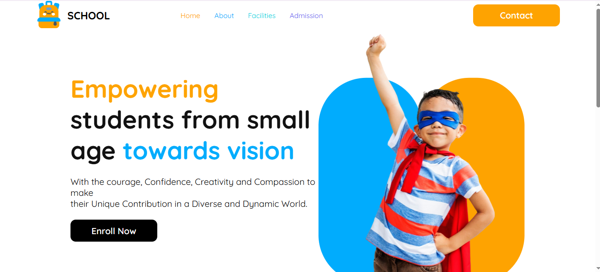

# 🧒 Learnify Kids – Fun & Interactive Learning Website

**Learnify Kids** is a colorful and interactive educational website built for young learners. This project is focused on making learning fun through a simple, accessible, and responsive design using just HTML and CSS.

---

## 🔗 Live Demo  
🎉 [Visit the Website Here](https://tawhide16.github.io/assignment-2/)

---

## 🧰 Tech Stack

- HTML5  
- CSS3  

---

## ✨ Features

- 📖 Simple and clean layout for kids
- 🎨 Colorful design to grab attention
- 💻 Fully responsive on all devices
- 🧩 Interactive sections for learning shapes, numbers, and more

---

## 📸 Screenshot



> Make sure to upload the screenshot in an `assets/` folder and update the link if needed

---

## 🚀 Run Locally

```bash
git clone https://github.com/Tawhide16/assignment-2.git
cd assignment-2
# Then open index.html in your browser
